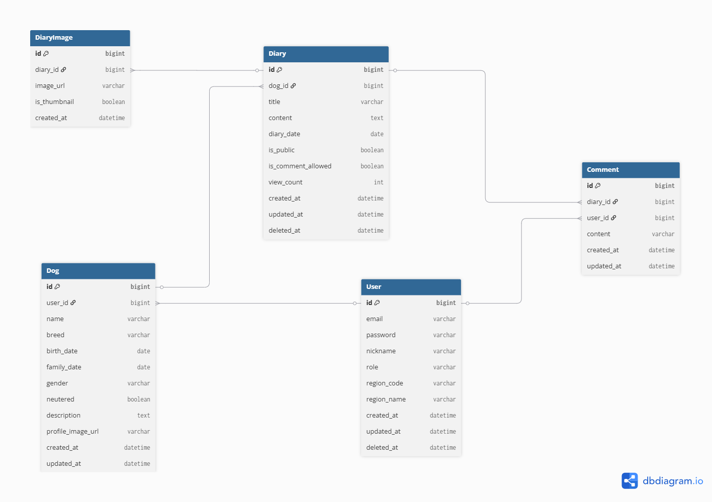

# ERD

## 엔티티

- User
- Dog
- Diary
- DiaryImage
- Comment

## 관계

- User 1:N Dog
- Dog 1:N Diary
- Diary 1:N DiaryImage
- Diary 1:N Comment
- User 1:N Comment

## User

| 컬럼명         | 타입           | 설명         |
| ----------- | ------------ | ---------- |
| id          | BIGINT       | 회원 ID (PK) |
| email       | VARCHAR(255) | 이메일        |
| password    | VARCHAR(255) | 비밀번호       |
| nickname    | VARCHAR(50)  | 닉네임        |
| role        | VARCHAR(20)  | 권한 (ROLE_USER, ROLE_ADMIN) |
| region_code | VARCHAR(20)  | 행정동 코드     |
| region_name | VARCHAR(100) | 지역명        |
| created_at  | DATETIME     | 생성일        |
| updated_at  | DATETIME     | 수정일        |
| deleted_at  | DATETIME     | 삭제일 (Soft Delete) |

---

## Dog

| 컬럼명               | 타입           | 설명          |
| ----------------- | ------------ | ----------- |
| id                | BIGINT       | 반려견 ID (PK) |
| user_id           | BIGINT       | 회원 ID (FK)  |
| name              | VARCHAR(50)  | 이름          |
| breed             | VARCHAR(50)  | 견종          |
| birth_date        | DATE         | 생일 (선택)     |
| family_date       | DATE         | 가족이 된 날     |
| gender            | VARCHAR(10)  | 성별          |
| neutered          | BOOLEAN      | 중성화 여부      |
| description       | TEXT         | 소개글         |
| profile_image_url | VARCHAR(500) | 프로필 이미지     |
| created_at        | DATETIME     | 생성일         |
| updated_at        | DATETIME     | 수정일         |

---

# Diary

| 컬럼명                | 타입           | 설명               |
|--------------------|--------------|------------------|
| id                 | BIGINT       | 일기 ID (PK)       |
| dog_id             | BIGINT       | 반려견 ID (FK)      |
| title              | VARCHAR(100) | 제목               |
| content            | TEXT         | 내용               |
| diary_date         | DATE         | 일기 작성 날짜        |
| is_public          | BOOLEAN      | 전체 공개 여부        |
| is_comment_allowed | BOOLEAN      | 댓글 허용 여부        |
| view_count         | INT          | 조회수              |
| created_at         | DATETIME     | 생성일              |
| updated_at         | DATETIME     | 수정일              |
| deleted_at         | DATETIME     | 삭제일 (Soft Delete) |

---

# DiaryImage

| 컬럼명          | 타입           | 설명          |
| ------------ | ------------ | ----------- |
| id           | BIGINT       | 이미지 ID (PK) |
| diary_id     | BIGINT       | 일기 ID (FK)  |
| image_url    | VARCHAR(500) | 이미지 경로      |
| is_thumbnail | BOOLEAN      | 대표 이미지 여부   |
| created_at   | DATETIME     | 생성일         |

---

# Comment

| 컬럼명        | 타입            | 설명          |
|------------|---------------| ----------- |
| id         | BIGINT        | 댓글 ID (PK)  |
| diary_id   | BIGINT        | 일기 ID (FK) |
| user_id    | BIGINT        | 작성자 ID (FK) |
| content    | VARCHAR(1000) | 댓글 내용       |
| created_at | DATETIME      | 생성일         |
| updated_at | DATETIME      | 수정일         |

---
